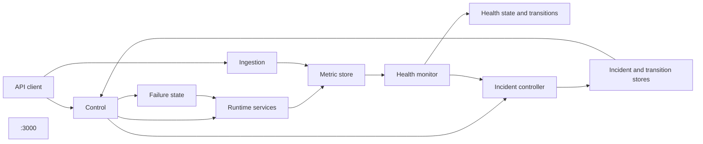

# Architecture diagram

```mermaid
flowchart LR
    Client["API client"]
    Server[":3000"]
    Runtime["Runtime services"]
    Failure["Failure state"]
    Metrics["Metric store"]
    Health["Health monitor"]
    HealthState["Health state and transitions"]
    Incident["Incident controller"]
    IncidentStores["Incident and transition stores"]

    Client --> Control
    Client --> Ingestion
    Control --> Failure
    Control --> Incident
    Control --> Runtime
    Failure --> Runtime
    Runtime --> Metrics
    Ingestion --> Metrics
    Metrics --> Health
    Health --> HealthState
    Health --> Incident
    Incident --> IncidentStores
    IncidentStores --> Control
```

All nodes run in one Node.js process, and every store shown is in memory.
