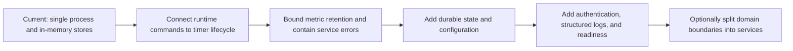

# Future roadmap

This page separates possible evolution from current behavior. It is directional, not a release commitment.

## Candidate milestones

1. Make runtime status authoritative by wiring start, stop, and restart to service timers.
2. Add graceful shutdown, configurable ports, bounded telemetry retention, and error isolation for timer callbacks.
3. Persist metrics, health transitions, and incidents behind repository interfaces.
4. Add API authentication, consistent error envelopes, pagination, structured logging, and health/readiness endpoints.
5. Introduce queues or network boundaries only where independent scaling or failure isolation justifies them.

Each milestone should retain the current domain ownership and add tests before increasing deployment complexity.
