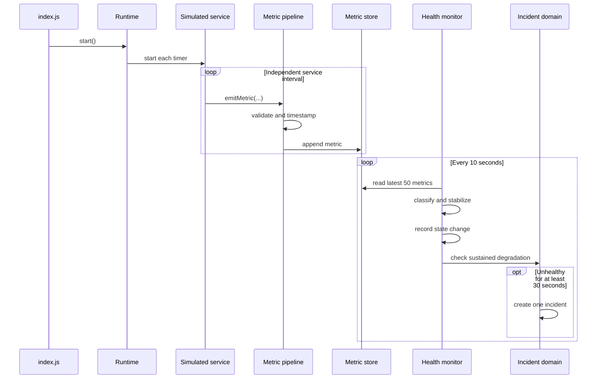

# Runtime flow

```mermaid
sequenceDiagram
    participant Boot as index.js
    participant Runtime
    participant Service as Simulated service
    participant Telemetry as Metric pipeline
    participant Store as Metric store
    participant Health as Health monitor
    participant Incidents as Incident domain

    Boot->>Runtime: start()
    Runtime->>Service: start each timer
    loop Independent service interval
        Service->>Telemetry: emitMetric(...)
        Telemetry->>Telemetry: validate and timestamp
        Telemetry->>Store: append metric
    end
    loop Every 10 seconds
        Health->>Store: read latest 50 metrics
        Health->>Health: classify and stabilize
        Health->>Health: record state change
        Health->>Incidents: check sustained degradation
        opt Unhealthy for at least 30 seconds
            Incidents->>Incidents: create one incident
        end
    end
```

Control requests can change logical runtime state and failure flags at any time. Failure flags are read on future service ticks.
